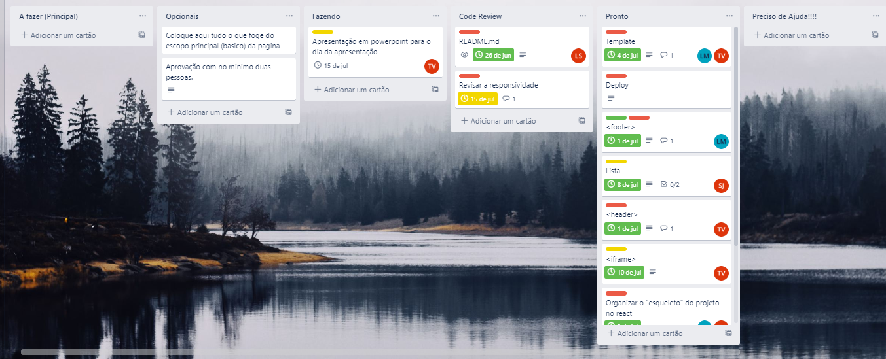

# 

## Stack utilizada

 -   
 -   
 -   	 
 -    

  ### Designer

  - Elaborado por *Lucas Matheus e Tamara*
   [](https://www.figma.com/file/lvUHlLU4aFjhgKcwTcSmR9/Untitled?node-id=1%3A2)

## Gestao do Projeto
### Trello

 

## Repositorio

  [](https://github.com/grupo3-gama/criptogama.git)

## Instalação

#### Clonando e Instalando o projeto com npm

```bash
 git clone https://github.com/grupo3-gama/criptogama.git

 cd criptogama/

 npm install

 npm run start 
```

## Autores

   [](https://www.github.com/LucasCardim) [](https://www.linkedin.com/in/lucascardim)

  [](https://www.github.com/LucasZerino) [](https://www.linkedin.com/in/lucascardim)

  [](https://www.github.com/tamaraafvieira) [](https://www.linkedin.com/in/tamaraafvieira)  

   [](https://www.github.com/luisroxis) [](https://www.linkedin.com/in/luiscroxis)  


## Deploy


## Aplicacao

 
 [](https://criptogama-zeta.vercel.app/)